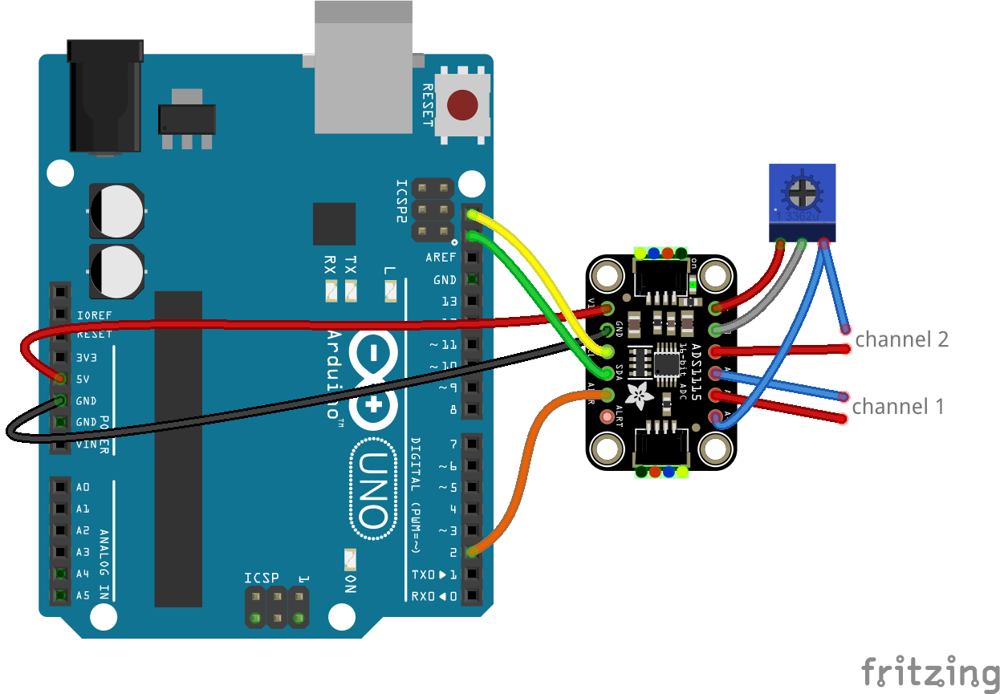
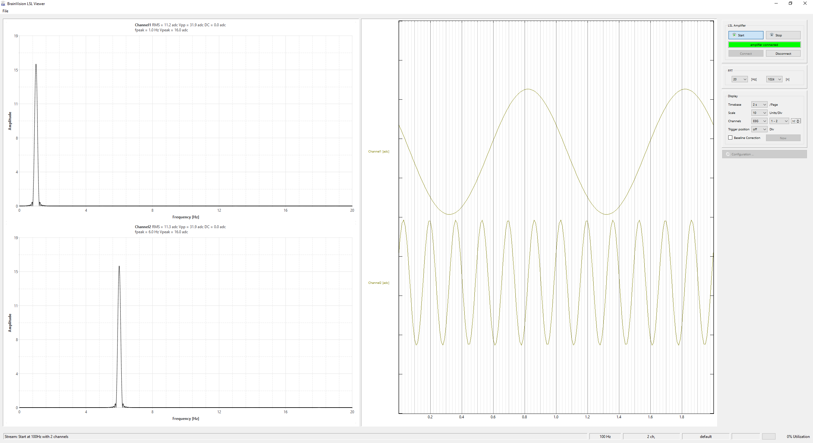

---

# lsl-ads1115

Stream two analog input channels from an ADS1115 ADC to a PC via Lab Streaming Layer (LSL).

---

## Overview

This project streams two analog channels sampled by an ADS1115 (I²C, 16-bit ADC) to a PC using LSL.

**Hardware required:**

* ADS1115 breakout board (Adafruit)
* Arduino UNO
* USB cable

Connect the ADS1115 to the Arduino as shown:



---

## Analog Input Configuration

The ADS1115 provides two differential channel pairs:

* `AIN0 – AIN1`
* `AIN2 – AIN3`

### Configuration as shown in the wiring diagram

* **Channel 1:** Differential (`AIN0 – AIN1`)
* **Channel 2:** Single-ended with offset adjustment (via potentiometer)

If your sensor outputs **2.5 V at zero response**, the potentiometer can be used to shift the baseline to 0 V at the ADC input.

### Alternative: Single-ended inputs

You can use `AIN0` and `AIN2` as single-ended inputs by tying:

* `AIN1` → GND
* `AIN3` → GND

Refer to the ADS1115 datasheet for electrical limits.

---

## Arduino Sketches

### 1. `ads1115-sampler`

Interfaces the ADS1115 with the PC and streams:

* 2 differential channels
* 100 Hz per channel
* Stable, timing-controlled data transmission

Designed to maintain a constant sampling interval.

### 2. `dummy-sampler`

Does **not** require the ADC.

Generates two independent sine waves (1Hz and 6Hz by default) for:

* Testing serial communication
* Verifying LSL streaming at 100Hz rate
* Evaluating signal integrity (e.g., via FFT)

You can analyze the received signal using Brain Products' LSL Viewer.



---

## Sampler Sketch Configuration

### Adjusting the input voltage Range (Gain)

Edit in `ads1115-sampler`:

```cpp
ads.setGain(GAIN_TWO);  // ±2.048 V full-scale range
```

Available gain settings:

| Gain Setting     | Full-Scale Range | Notes                             |
| ---------------- | ---------------- | --------------------------------- |
| `GAIN_TWOTHIRDS` | ±6.144 V         | Limited by chip max input voltage |
| `GAIN_ONE`       | ±4.096 V         | Limited by chip max input voltage |
| `GAIN_TWO`       | ±2.048 V         | Default                           |
| `GAIN_FOUR`      | ±1.024 V         |                                   |
| `GAIN_EIGHT`     | ±0.512 V         |                                   |
| `GAIN_SIXTEEN`   | ±0.256 V         |                                   |

Always ensure input voltages remain within safe limits!

### Adjust Sampling Rate

The ADS1115 internal data rate is configured via:

```cpp
ads.setDataRate(RATE_ADS1115_250SPS);
```

Increasing the data rate:

* Shortens ADC conversion time
* Requires loop timing adjustment
* May cause overruns if not handled carefully

Use the debug pin output and verify timing (e.g., with an oscilloscope) if precise timing is critical.

---

## PC-Side Applications (`stream-outlet`)

Two receiver programs are included:

* `ads1115_rx.py` → Communication test tool
* `ads1115_lsl` → Actual LSL stream outlet

The CL input argument here is the serial port name e.g.:

`python3 ads1115_lsl.py /dev/ttyACM0`

During startup (Arduino reset), a few packets may be dropped. The stream stabilizes automatically after initialization.

---

## Notes

* Sampling rate: 100 Hz per channel (default configuration)
* ADC resolution: 16-bit
* Communication: Serial (USB)
* Streaming protocol: LSL

